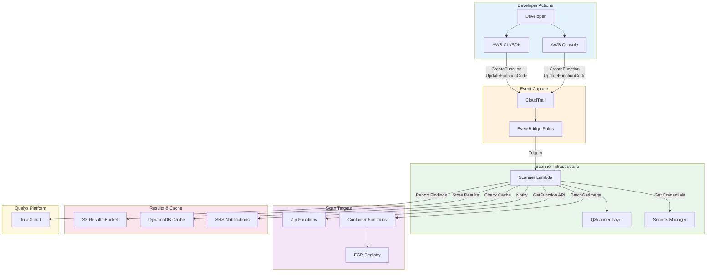
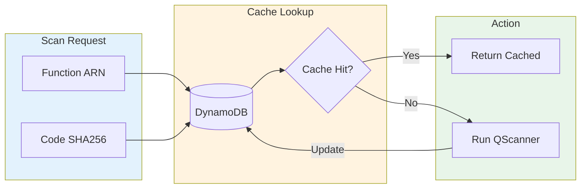
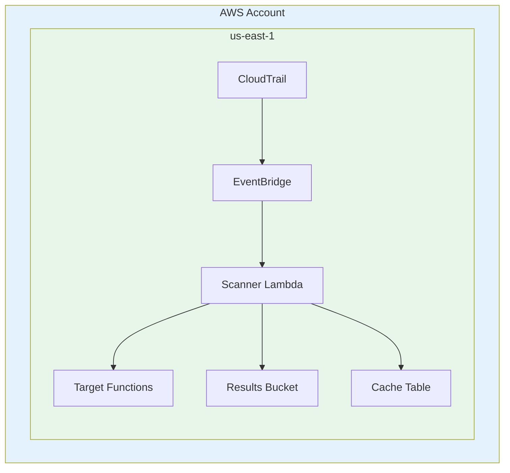
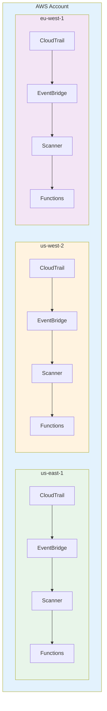
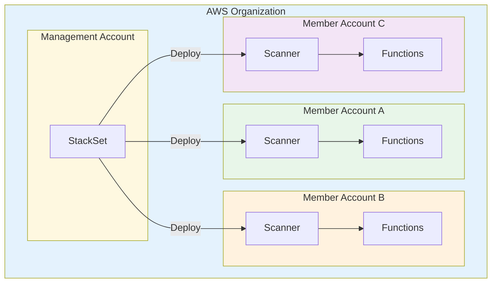
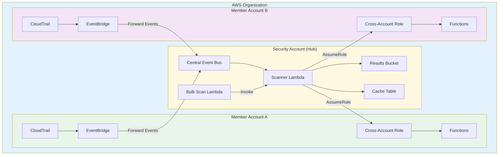
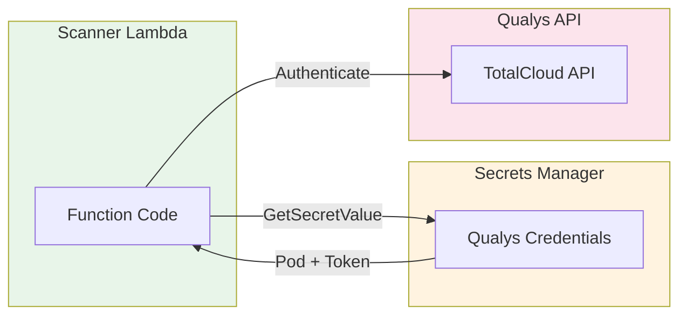
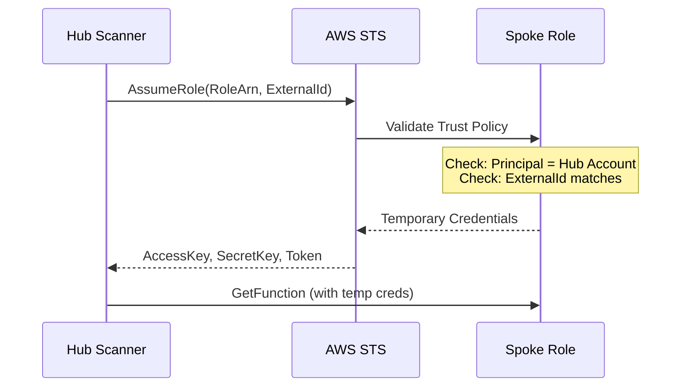
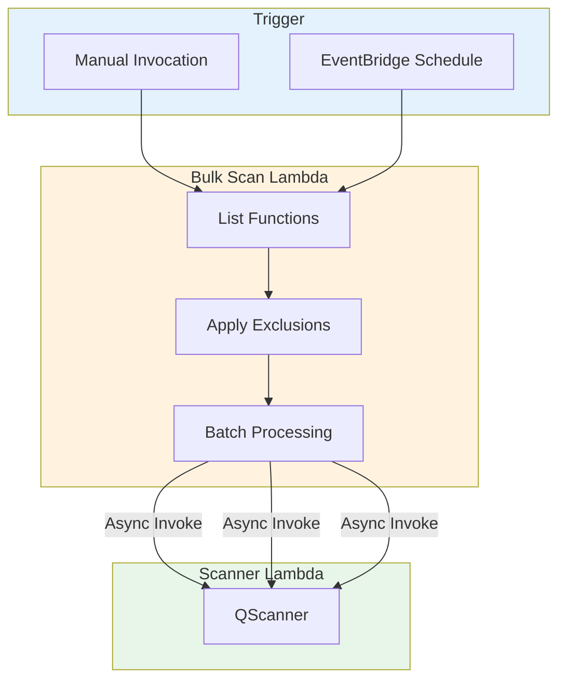

# Event-Driven Lambda Scanning Architecture

This document describes the technical architecture for automated vulnerability scanning of AWS Lambda functions using Qualys QScanner. The solution captures Lambda deployment events and triggers security scans without manual intervention.

## Architecture Overview

The scanner operates as a Lambda function triggered by CloudTrail events via EventBridge. When developers create or update Lambda functions, the scanner automatically retrieves and analyzes the deployment package for vulnerabilities and exposed secrets.

## Core Components

### Event Detection

CloudTrail captures all Lambda API calls across the account. EventBridge rules match specific events that indicate code changes:

| Event Name | Trigger Condition |
|------------|-------------------|
| `CreateFunction20150331` | New function deployment |
| `UpdateFunctionCode20150331v2` | Code update to existing function |
| `UpdateFunctionConfiguration20150331v2` | Configuration change (optional) |

The scanner ignores its own deployments to prevent infinite scan loops.

### Scanner Lambda

The scanner Lambda executes QScanner against target functions. Key characteristics:

- **Memory**: 2048 MB default (configurable 512-10240 MB)
- **Timeout**: 900 seconds maximum
- **Ephemeral Storage**: 2048 MB for temporary scan artifacts
- **Reserved Concurrency**: 10 concurrent executions (prevents runaway during mass deployments)

QScanner runs as a Lambda Layer, keeping the function code minimal and updates independent.

### Scan Caching

DynamoDB stores scan results keyed by function ARN and code SHA256. When code hasn't changed, the scanner returns cached results instead of re-scanning:

Cache TTL is configurable from 1-365 days (default: 30 days).

## Deployment Patterns

### Single Account, Single Region

The simplest deployment monitors Lambda functions within one AWS account and region.

**Use case**: Development environments, single-region production workloads.

### Single Account, Multi-Region

For organizations with Lambda functions across multiple regions, deploy the scanner stack to each region independently.

Each region maintains independent caches and results. Qualys TotalCloud aggregates findings centrally.

### Multi-Account with StackSets

For AWS Organizations, deploy scanner infrastructure to all member accounts using CloudFormation StackSets.

Each account operates independently with its own credentials, caches, and results storage.

### Centralized Hub-Spoke

For centralized security operations, deploy a single scanner in a security account that receives events from all member accounts.

**Key features**:
- Single scanner Lambda in security account
- EventBridge cross-account event forwarding
- Cross-account role assumption with External ID
- Centralized results and caching
- Bulk scan capability for existing functions

## Security Implementation

### Credential Management

Qualys API credentials are stored in AWS Secrets Manager, never in environment variables or code:

### Encryption

All data at rest uses customer-managed KMS keys:

| Resource | Encryption |
|----------|------------|
| DynamoDB Cache | KMS CMK |
| S3 Results Bucket | KMS CMK or AES-256 |
| SNS Notifications | KMS CMK |
| SQS Dead Letter Queue | KMS CMK |
| CloudWatch Logs | KMS CMK |
| Secrets Manager | KMS CMK |

S3 bucket policies enforce HTTPS-only access.

### IAM Least Privilege

The scanner Lambda role follows least-privilege principles:

| Permission | Scope |
|------------|-------|
| `lambda:GetFunction` | All functions in account |
| `lambda:TagResource` | Only `QualysScan*` tags |
| `ecr:BatchGetImage` | All repositories in account |
| `secretsmanager:GetSecretValue` | Specific secret ARN only |
| `dynamodb:GetItem/PutItem` | Specific table only |
| `s3:PutObject` | Specific bucket only |
| `sns:Publish` | Specific topic only |
| `cloudwatch:PutMetricData` | `QualysLambdaScanner` namespace only |

### Cross-Account Security

Hub-spoke deployments use External ID to prevent confused deputy attacks:

The External ID must match between hub and spoke deployments.

## Bulk Scanning

The bulk scan Lambda enables on-demand scanning of all existing functions:

**Configuration options**:
- `BATCH_SIZE`: Functions per batch (default: 100)
- `MAX_WORKERS`: Concurrent invocations (default: 10)
- `INVOCATION_DELAY_MS`: Pause between batches (default: 100ms)
- `EXCLUDE_PATTERNS`: Skip matching function names

## Observability

### CloudWatch Metrics

The scanner publishes custom metrics to the `QualysLambdaScanner` namespace:

| Metric | Description |
|--------|-------------|
| `ScanSuccess` | Successful scan completions |
| `ScanPartialSuccess` | Scans with partial results |
| `ScanDuration` | Time to complete scan (seconds) |
| `CacheHit` | Scans skipped due to cache |
| `VulnerabilityCount` | Vulnerabilities detected |

### CloudWatch Alarms

Pre-configured alarms monitor scanner health:

- **Scanner Errors**: More than 5 errors in 5 minutes
- **Scanner Throttles**: Any throttling detected
- **DLQ Messages**: Failed invocations requiring investigation
- **Duration Warning**: Scans approaching timeout threshold

### X-Ray Tracing

Active tracing enables end-to-end visibility across the scan workflow for debugging and performance analysis.

## Cost Considerations

Monthly costs for typical deployments:

| Deployment Size | Daily Deployments | Estimated Monthly Cost |
|-----------------|-------------------|------------------------|
| Small | 50 | $5-10 |
| Medium | 500 | $15-25 |
| Large | 2000 | $40-60 |

**Cost drivers**:
- Lambda invocations and duration
- DynamoDB read/write capacity (on-demand billing)
- S3 storage for results
- CloudTrail events (if creating new trail)
- KMS API calls

Scan caching significantly reduces costs by avoiding redundant scans of unchanged code.

## Quick Start

1. **Create Qualys credentials** in Secrets Manager
2. **Deploy scanner stack** via CloudFormation or Terraform
3. **Verify EventBridge rules** are capturing Lambda events
4. **Deploy a test function** and confirm scan execution
5. **Check Qualys TotalCloud** for vulnerability findings

For detailed deployment instructions, see the [README](../README.md).
